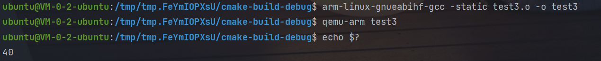
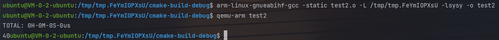

# ARMv7 32位架构下的汇编器

使用C语言实现一个sysy语言代码的汇编器

## 交叉编译环境配置

```
export PATH=/opt/pkg/gcc_linaro/gcc-arm-8.2-2018.08-x86_64-arm-linux-gnueabihf/bin:$PATH

arm-linux-gnueabihf-gcc
```

参照https://blog.csdn.net/q544344318/article/details/128273473


## 1. 汇编无外部符号的文件

main分支下：

使用了一个简单的测试样例：

```c
//test the priority of add and mul
int main(){
    int a, b, c, d;
    a = 10;
    b = 4;
    c = 2;
    d = 2;
    return c + a * b - d; 
}
```

用编译器得到的.s

```
        .global main
main:
        stmfd   sp!,{r11,lr}
        sub     sp,sp,#8
        mov     r0,#40
        add     sp,sp,#8
        ldmfd   sp!,{r11,lr}
        bx      lr
```

运行参数如下：

```
-o "test3.o" "../test3.s"
```

得到test3.o文件

使用交叉编译环境检测生成的文件是否可用：

```
arm-linux-gnueabihf-gcc -static test3.o -o test3
qemu-arm test3
echo $?
```

得到正确结果40



## 2. 汇编有外部符号的文件

rel分支下

目前应该是只做了调用外部函数的，因为sysy语言好像没有涉及到调用其他外部符号，所以暂未处理。

使用的测试用例在之前的基础上增加putint()函数调用

```c
//test the priority of add and mul
int main(){
    int a, b, c, d;
    a = 10;
    b = 4;
    c = 2;
    d = 2;
    putint(c + a * b - d);
    return 1;
}
```

用编译器得到的.s

```
        .global main
main:
        stmfd   sp!,{r11,lr}
        sub     sp,sp,#8
        push    { r3,r12,r14 }
        sub     sp,sp,#4
        mov     r0,#40
        bl      putint
        add     sp,sp,#4
        pop     { r3,r12,r14 }
        mov     r0,#1
        add     sp,sp,#8
        ldmfd   sp!,{r11,lr}
        bx      lr
```

运行参数如下：

```
-o "test2.o" "../test2.s"
```

得到test3.o文件

使用交叉编译环境检测生成的文件是否可用：

```
arm-linux-gnueabihf-gcc -static test2.o -L /tmp/tmp.FeYmIOPXsU -lsysy -o test2
qemu-arm test2
```

得到正确输出，打印出时间与40：

