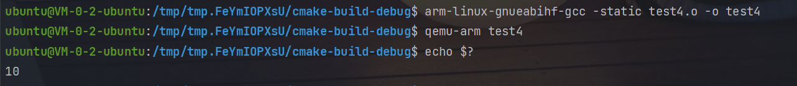
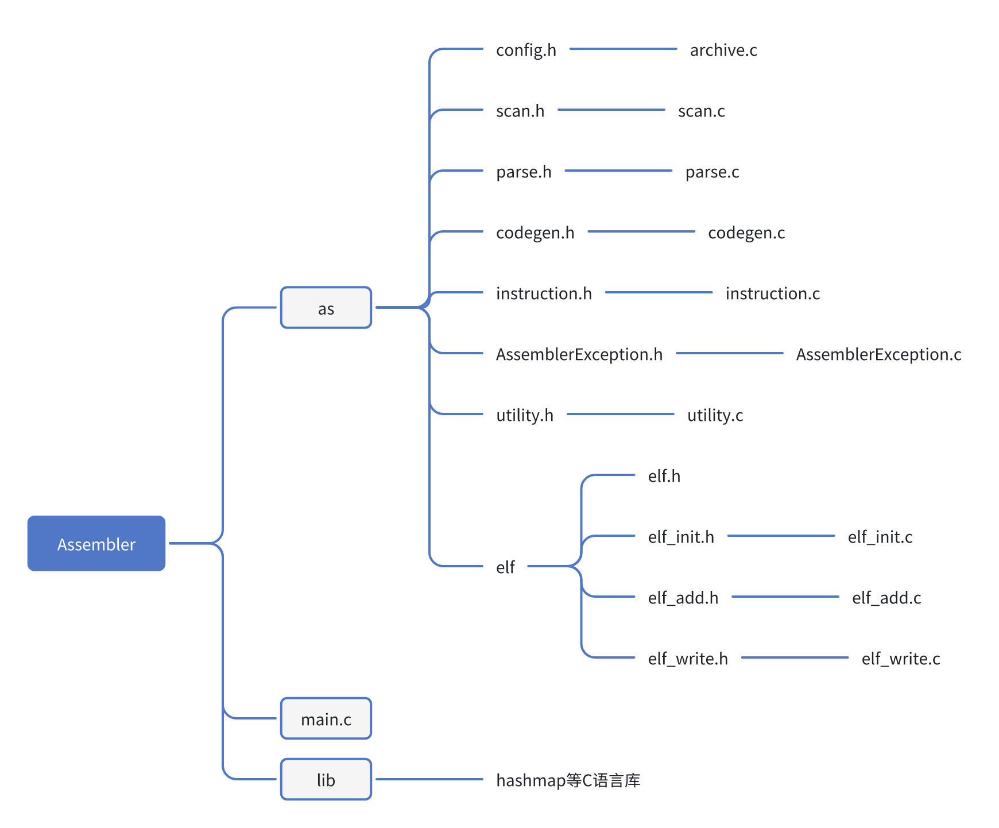
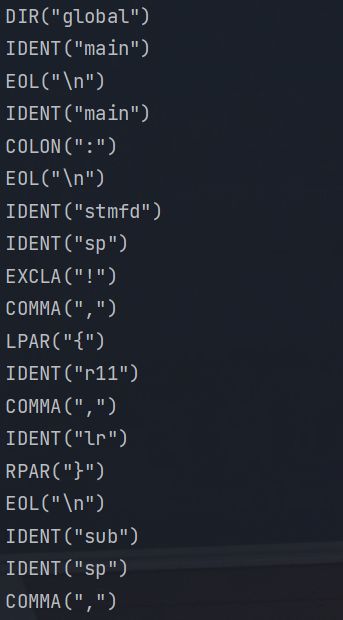
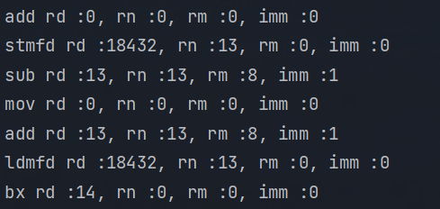
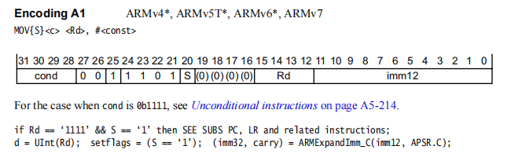
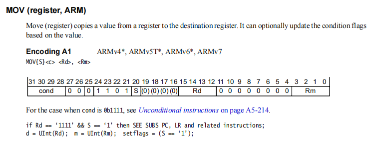
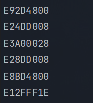
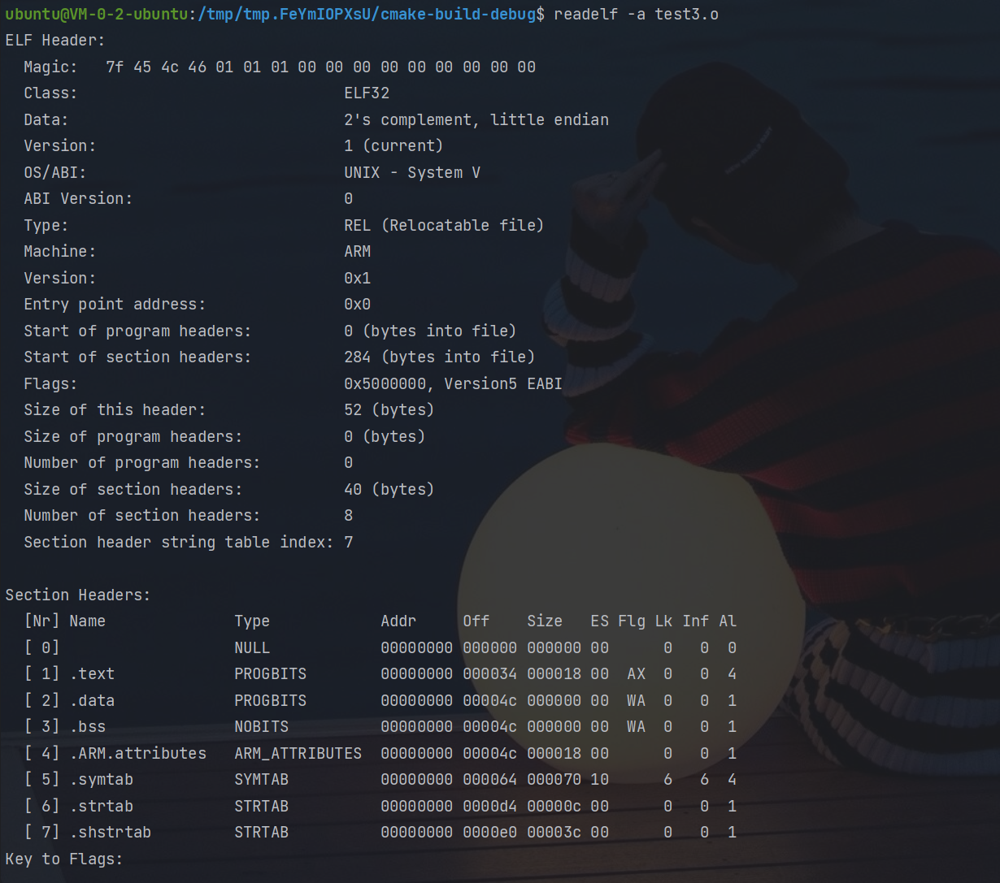
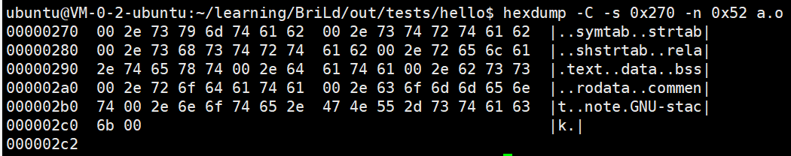

# ARMv7 32位架构下的汇编器

使用C语言实现一个sysy语言代码的汇编器

## 交叉编译环境配置

```
export PATH=/opt/pkg/gcc_linaro/gcc-arm-8.2-2018.08-x86_64-arm-linux-gnueabihf/bin:$PATH

arm-linux-gnueabihf-gcc
```

参照https://blog.csdn.net/q544344318/article/details/128273473


## 测试样例说明

### 1. 汇编无外部符号的文件

main分支下：

使用了一个简单的测试样例：

```c
//test the priority of add and mul
int main(){
    int a, b, c, d;
    a = 10;
    b = 4;
    c = 2;
    d = 2;
    return c + a * b - d; 
}
```

用编译器得到的.s

```
        .global main
main:
        stmfd   sp!,{r11,lr}
        sub     sp,sp,#8
        mov     r0,#40
        add     sp,sp,#8
        ldmfd   sp!,{r11,lr}
        bx      lr
```

运行参数如下：

```
-o "test3.o" "../test3.s"
```

得到test3.o文件

使用交叉编译环境检测生成的文件是否可用：

```
arm-linux-gnueabihf-gcc -static test3.o -o test3
qemu-arm test3
echo $?
```

得到正确结果40


### 2. 汇编无外部符号的文件 + label跳转

main分支下：

加入了一个简单的函数调用例子，使汇编涉及到label跳转

```c
void putint(){
    int a;
    return;
}

int main(){
    int a;
    a = 10;
    putint();
    return a;
}
```

用编译器得到的.s

```
        .global main
putint:
        sub     sp, sp, #4
        add     sp, sp, #4
        bx      lr
main:
        push    {r11, lr}
        mov     r11, sp
        sub     sp, sp, #8
        mov     r0, #0
        str     r0, [sp, #4]
        mov     r0, #10
        str     r0, [sp]
        bl      putint
        ldr     r0, [sp]
        mov     sp, r11
        pop     {r11, lr}
        bx      lr

```

运行参数如下：

```
-o "test4.o" "../test4.s"
```

得到test4.o文件

使用交叉编译环境检测生成的文件是否可用：

```
arm-linux-gnueabihf-gcc -static test4.o -o test4
qemu-arm test4
echo $?
```

得到正确结果10



### 3. 汇编有外部符号的文件

rel分支下

目前应该是只做了调用外部函数的，因为sysy语言好像没有涉及到调用其他外部符号，所以暂未处理。

使用的测试用例在之前的基础上增加putint()函数调用

```c
//test the priority of add and mul
int main(){
    int a, b, c, d;
    a = 10;
    b = 4;
    c = 2;
    d = 2;
    putint(c + a * b - d);
    return 1;
}
```

用编译器得到的.s

```
        .global main
main:
        stmfd   sp!,{r11,lr}
        sub     sp,sp,#8
        push    { r3,r12,r14 }
        sub     sp,sp,#4
        mov     r0,#40
        bl      putint
        add     sp,sp,#4
        pop     { r3,r12,r14 }
        mov     r0,#1
        add     sp,sp,#8
        ldmfd   sp!,{r11,lr}
        bx      lr
```

运行参数如下：

```
-o "test2.o" "../test2.s"
```

得到test2.o文件

使用交叉编译环境检测生成的文件是否可用：

```
arm-linux-gnueabihf-gcc -static test2.o -L /tmp/tmp.FeYmIOPXsU -lsysy -o test2
qemu-arm test2
```

得到正确输出，打印出时间与40：


### 测试脚本

增加了测试脚本，可以一次性运行所有.s文件进行测试，即test文件下的`sy.sh`，可在Makefile中的`make test`调用

```sh
#!/bin/bash

script_dir=$(dirname "$(realpath "$0")")

# 切换到当前脚本所在的目录
cd "$script_dir" || exit

# 遍历当前文件夹下的所有 .s 文件
for file_name in *.s; do
    # 检查文件是否存在
    if [ ! -f "$file_name" ]; then
        echo "文件 $file_name 不存在"
        continue  # 继续下一个文件
    fi

    test_name=$(basename "$file_name" .s)
    echo "file name $file_name"
    t=out/$test_name

    mkdir -p "$t"

    # 执行文件
    chmod +x "$file_name"  # 添加执行权限
    ../cmake-build-debug/as_final  -o "$t"/res "$file_name"
    arm-linux-gnueabihf-gcc -static "$t"/res -o "$t"/fi_res
    qemu-arm "$t"/fi_res
    echo $?
done
```

Makefile

```makefile
build:
	rm -rf cmake-build-debug
	mkdir cmake-build-debug
	cd cmake-build-debug && cmake ..
	make -C cmake-build-debug

test:
	chmod 777 ./test/sy.sh
	@printf '\e[32mBegin Test\e[0m\n'
	./test/sy.sh
	@printf '\e[32mPassed all tests\e[0m\n'

clean:
	rm -rf test/out/
	rm -rf ./cmake-build-debug/as_final

.PHONY: build clean test
```


## 项目结构



- config：输出文件位置等配置信息
- scan：词法分析
- parse：语法分析
- codegen：生成uint32_t大小的instruction数组，并填充elf文件
- elf文件夹包括elf文件结构体与往文件里填充写入的一些函数


## 整体思路及重要环节的步骤

### 1. 词法分析

主要通过主函数中的`scan_table_scan(&scan_table, config.source, config.source_len);`处理：

1. 将读取到的token进行分类标识：

   ```c
   enum scan_token_enum {
       TK_IDENT,    /* (identifier) add, sub, mul, foo, r0, r1, lr, ... */
       TK_DIR,      /* (directive) .global */
       TK_IMM,      /* #1, #-2, ... */
       TK_COMMA,    /* , */
       TK_LBRACKET, /* [ */
       TK_RBRACKET, /* ] */
       TK_COLON,    /* : */
       TK_LPAR,     /* { */
       TK_RPAR,     /* } */
       //TK_RANGE,    /* - */
       TK_EXLCA,    /* ! */
       TK_EOL,      /* End of line */
       TK_EOT,      /* End of text */
       TK_NONE,     /* Invalid token */
       TK_ANY,      /* Special whilecard token for parsing */
   };
   ```

2. 构建scan_table_st结构体保存读取到的token数组：

   ```c
   struct scan_table_st {
       struct scan_token_st table[SCAN_TOKEN_TABLE_LEN];
       int len;
       int next;
   };
   ```

3. 在`char * scan_token(char *p, char *end, struct scan_token_st *tp)`函数中循环读取token，分类进行保存：

   ```c
   char * scan_token(char *p, char *end, struct scan_token_st *tp) {
       if (p == end) {
           p = scan_read_token(tp, p, 0, TK_EOT);
       } else if ((*p == '/') && (*(p + 1) == '*')) {
           /* Ignore C-style comments */
           p = scan_c_comment(p, end);
           p = scan_token(p, end, tp);
       } else if (scan_is_whitespace(*p)) {
           p = scan_whitespace(p, end);
           p = scan_token(p, end, tp);
       } else if (scan_is_letter(*p)) {
           p = scan_ident(p, end, tp);
           //...省略很多else if
       } else {
           //TODO 跳过处理
           p += 1;
           p = scan_token(p, end, tp);
       }
   
       return p;
   }
   ```

   

4. 词法分析结果如下：

   


### 2. 语法分析

主要在`parse_program(&scan_table);`中完成。

1. 将寄存器名与对应数字进行匹配，将指令等与opcode对应，方便后续处理：

   ```c
   #define PARSE_REG_PAIR_MAP \
      { {"r0", 0}, {"r1", 1}, {"r2", 2,}, {"r3", 3}, \
        {"r4", 4}, {"r5", 5}, {"r6", 6,}, {"r7", 7}, \
        {"r8", 8}, {"r9", 9}, {"r10", 10}, {"r11", 11}, \
        {"r12", 12}, {"r13", 13}, {"r14", 14,}, {"r15", 15}, \
        {"fp", 11}, {"ip", 12}, {"sp", 13}, {"lr", 14}, {"pc", 15} }
   ```

   指令与cond的匹配关系略，详见instruction.h。

2. 构建instruction struct，在语法分析时需要填充instruction结构体，拿到寄存器等足够的信息以便后续将instruction转为uint32_t类型。

   instruction结构体如下：

   ```c
   typedef struct Instruction {
       enum Opcode opcode;   // id indicating the instruction
       enum COND cond;
       Operand rd;     //rd
       Operand rn;     //src1
       Operand rm;     //src2
       Operand shift;
       uint32_t shift_amount;  // shift amount
       unsigned int imm : 1;      //I 位
   
       char label[MAX_LABEL_LENGTH]; // label of the line this Instruction appears on
       char branch_label[MAX_LABEL_LENGTH];  // label used by branch or jump instructions
   }Instruction;
   ```

   主要是寄存器与移位立即数等信息，还有一些辅助信息，比如imm位代表后续uint32_t类型的I位，而label和branch_label则代表了跳转标识和要跳转的位置。

   其中对于操作数的Operand结构体：

   ```c
   typedef struct Operand {
       uint8_t reg;
       signed int imm;
       unsigned int isreg : 1;       //表明reg是0 - 15
       unsigned int immisreg : 1;    //表明是imm还是reg
       unsigned int writeback : 1;    //^与!需要writeback
   }Operand;
   ```

   除了寄存器值外，还需要能分辨出是立即数还是寄存器，是单寄存器还是多寄存器，需不需要回写等等。

3. 在parse_program中遍历收集到的token，通过换行符分隔出属于一条指令的tokens，对每组token调用`struct Instruction* parse_instruction(struct scan_table_st *st)`，首先新建一条blank instruction，其中通过指令类型不同走不同的if else处理分支，在不同分支内填充instruction结构体信息，详见代码。每完成一条指令，pc + 4。

   此外还新建了Map保存全局的label地址和对应的pc，在分析完所有instruction后，将之前没有填充的非UNDEF的跳转位置进行填充，注意是填充相对偏移地址！

4. 在parse_program中将收集到的instruction加入instruction数组，即`addLast(inst_list, instruction);`最终得到指令array list `inst_list`。

5. 打印结果如下：

   


### 3. 生成uint32_t长度的instruction数组

通过`codegen_programme(&code_table);`将instruction结构体生成uint32_t类型值。

1. 构建codegen_table_st结构体：

   ```c
   struct codegen_table_st {
       uint32_t table[CODEGEN_TABLE_LEN];
       int len;
       struct codegen_global_pair *labels[CODEGEN_TABLE_LEN];
       int label_count;
       struct codegen_global_pair *publics[CODEGEN_TABLE_LEN];
       int public_count;
   };
   ```

   其中table数组保存生成的uint32_t指令数组，并且在结构体中也要记录下label与global符号的信息与数量，方便后续写入文件

2. 遍历`inst_list`，对于每条instruction，调用`codegen_inst(ct,&cur_inst);`处理。

3. 在`codegen_inst`中，用一个大switch case，根据不同的inst->opcode调用不同的codegen函数。主要需要参考armv7的手册，上面有对指令的详细要求。

   以不同的三地址mov指令来举例：

   - armv7手册上：

     立即数：

     

     寄存器：

     

   - 根据要求定下各个位的偏移const：

     其中第25位是判断是立即数还是寄存器。

     ```c
     const uint32_t DP_IMM_BIT = 25;
     const uint32_t DP_OP_BIT  = 21;
     const uint32_t DP_RD_BIT  = 12;
     ```

   - 根据具体instruction信息生成uint32_t的值：

     ```c
     inst = (cond_bit           << COND_BIT)
            | (!instruction->rn.immisreg << DP_IMM_BIT)
            | (opcode_bit      << DP_OP_BIT)
            | (rn               )
            | (rd  << DP_RD_BIT)
            ;
     ```

4. 生成完之后通过`codegen_add_inst`将uint32_t加入table数组。

5. 可以打印出对应的hex：

   


### 4. 填充elf文件——初始化context

在主函数中调用`codegen_elf_write(&code_table,config.objfile);`填充elf文件。

1. 构建elf_context数组，保存想写入的内容，这个struct代表整体文件内容：

   ```c
   /* elf_context represents all the information we collect to write the file */
   typedef struct {
       Elf32_Ehdr  ehdr;                       //elf文件
       elf_section sections[NUM_SECTIONS + 1]; // +1 for globals. See append_symbols()
       Elf32_Shdr  shdrs[NUM_SECTIONS];        //每个节都有一个对应的节表头部
   } elf_context;
   ```

   包含elf头、section header与各个sections的内容。

2. 调用`elf_init(&elf);`初始化elf_context，填充一些基本信息：

   - 初始化strtab，`init_strtab(elf, SEC_STRTAB)`

   - 初始化shstrtab，`init_strtab(elf, SEC_SHSTRTAB)`

     初始化一个字符串表，使其以一个 NULL 字节开头，这是 ELF 文件格式所要求的。
     字符串表中的第一个字符串的偏移量必须大于 0，以便区分第一个字符串和 NULL 字节。

   - 初始化arm基本属性，`init_arm_attributes(elf)`，包括version等等。

   - 初始化ehdr，`init_ehdr(elf);`

   - 初始化sections，`init_shdrs(elf);`，填充上shdr需要的type,flag等信息。

     以.text为例：

     ```c
     case SEC_TEXT:
                     shdrs[s].sh_type = SHT_PROGBITS;
                     shdrs[s].sh_flags = SHF_ALLOC | SHF_EXECINSTR;
                     shdrs[s].sh_addralign = sizeof(Elf32_Word);
                     break;
     ```

     并将它们加入elf_context的shdrs数组。

   - 初始化符号表项，`init_symbols(elf)`

     前几项是确定的，比如第一个符号一定是默认的NULL，后来是.text，.data，.bss表项。


### 5. 填充elf文件——进一步填写context

1. 首先需要将labelMap的信息填入codegen_table_，即将之前收集的global信息存入，`void addLabels(struct codegen_table_st *ct)`

2. 加入符号表：

   遍历之前记录的所有符号表项，根据之前对符号是不是global的记录，给符号标记：

   ```c
   if (codegen_is_public_label(ct, pl)) {
               binding = STB_GLOBAL;
           } else {
               binding = STB_LOCAL;
           }
   ```

   标记之后为接下来分别处理，最后填入这个符号项：`elf_add_symbol(&elf, pl->label, pl->offset, binding);`

3. 填充.text：

   遍历inst_list，调用`elf_add_instr(&elf,ct->table[i]);`填充进.text段


### 6. 将context内容写入最终文件

调用`elf_write_file(&elf, f)`写入最终生成的文件

1. `finalize_sections(elf_context *elf)`添加写入每个节都必须有的信息，并调用`align_sections(elf);`进行对齐
2. `finalize_shdrs(elf);`填充section header
3. `write_ehdr(elf, f)`写入ehdr
4. `write_sdata(elf, f)`写入各个section的具体内容
5. `write_shdrs(elf, f)`写入section header

最终生成.o文件，readelf可查看写入结果，内容十分极简：




## 心得体会

刚开始写汇编器的时候是对elf基本没有什么了解的，边写边学，最后汇编器的完善程度也远没有链接器那么好。很遗憾的就是，在写的时候由于对elf理解不够深刻，架构得有些不好，导致后面扩展很不容易。目前仓库里有两个分支，一个支持重定向的分支（rel分支），另一个是不支持重定向的分支（main分支），还没能完全整合到一起。主要是在处理时发现了一些问题，比如在shstrtab节中，.rel.text与.text共用了.text的部分，等等，有一些小细节，在做之前是没有考虑到的，没能处理得很好，还需后期继续弥补。



总的来说，写汇编器是我对elf的一个入门，帮助我学习了elf格式、重定向要求等等，还是收获颇丰，希望之后有时间能对它继续改进。